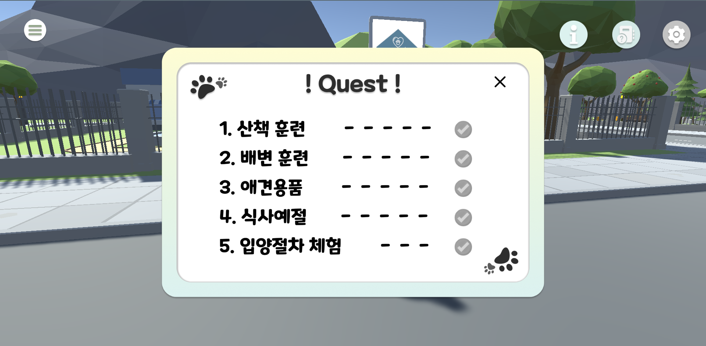

# 시연 시나리오

**목차**

1. 메인 페이지

2. 회원가입 및 로그인

3. 유니티

   0. 환경 설정

   1. 산책 훈련
   2. 배변 훈련
   3. 애견용품
   4. 식사예절
   5. 입양절차 체험

## 1. 메인 페이지

> 사용자는 우측 상단의 버튼을 클릭하여 로그인과 회원가입을 진행할 수 있습니다.
>
> 사용자는 미리보개 사진을 눌러 유니티를 실행할 수 있습니다. 

## 2. 회원가입과 로그인

> 사용자는 카카오톡으로 서비스 회원가입 및 로그인을 진행할 수 있습니다. 

> 카카오톡 아이디로 로그인을 진행합니다. 

> 회원가입 시 카카오 프로필 사진이 적용되고 닉네임을 입력할 수 있습니다. 

> 닉네임 입력 시 환영문구가 뜹니다.

> 로그인 시 뜨는 화면

## 3. 유니티

### 0. 환경 설정

> 게임 입장 시, 캐릭터를 선택할 수 있습니다.

> information 버튼 클릭 시, 조작키 안내를 볼 수 있습니다. 

> 퀘스트 버튼 클릭 시, 현재 퀘스트 진행도를 볼 수 있습니다. 

> 환경 설정 버튼 클릭 시, 배경 음악과 효과음 음량을 조절할 수 있습니다. 

### 1. 산책 훈련

> 산책 훈련 맵에 들어가면 플레이어와 강아지가 함께 산책합니다. 

> 플레이어가 npc 근처로 가면, 강아지가 npc를 향해 짖는 문제 상황을 볼 수 있습니다.

### 2. 배변 훈련

> 맵에 들어가면, 강아지가 배변 실수를 한 씬을 사용자에게 보여줍니다.

> O,X 퀴즈를 풀 수 있습니다. 

> 정답을 맞추면, 퀴즈 문제에 대한 풀이를 볼 수 있습니다. 

> 정답을 틀릴 시, 다시 한 번 생각해보세요 문구가 뜹니다. 

> 퀴즈를 다 풀면, 해당 훈련에 대한 정보 영상을 시청할 수 있습니다. 

> 체험 완료 시, 메인 맵으로 이동됩니다. 

### 3. 애견 용품

> 강아지 용품 맵에 입장할 수 있습니다. 

> 스페이스 바를 눌러 해당 퀘스트를 진행할 수 있습니다. 

### 4. 식사 예절

> 식사 예절 훈련 맵에 입장할 수 있습니다. 

### 5. 입양 절차

> 유기견 입양 체험 맵에 입장할 수 있습니다. 

> 맵에 입장하면, 퀘스트 창이 뜹니다.

> 사용자는 입양서약서에 서명을 합니다.

> 서명 완료 시, 강아지를 입양할 수 있게 됩니다.

> 입양 완료 시, 사용자는 강아지를 데리고 다니게 됩니다. 

> 병원으로 이동 시, 새로운 퀘스트가 뜹니다.

> 수의사에게 대화를 걸면, 다양한 검사가 있다는 것을 알려줍니다. 

> 건강 검진을 마치면, 퀘스트가 완료됩니다. 